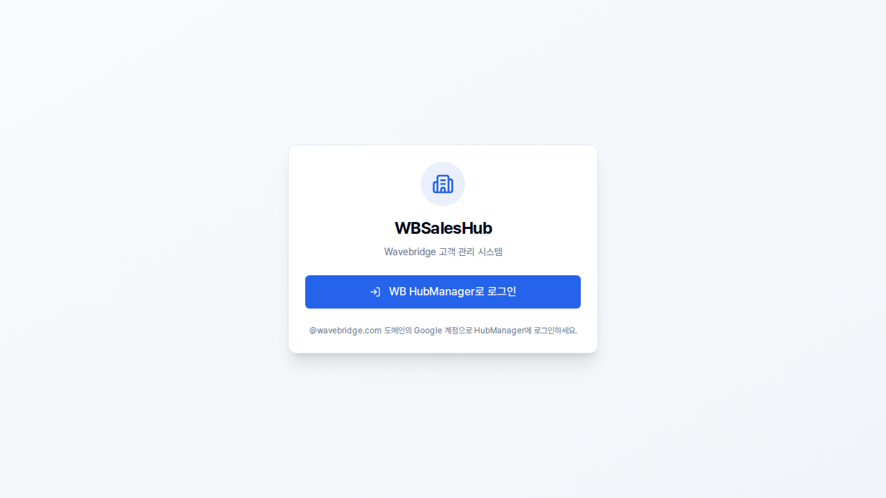

# SalesHub Oracle Cloud 운영 배포 로그

## 배포 정보
- **배포일**: 2026-01-06
- **대상**: WBSalesHub
- **환경**: Oracle Cloud (workhub.biz/saleshub)
- **상태**: 완료

---

## 해결된 이슈들

### 1. 502 Bad Gateway
- **원인**: SalesHub Docker 컨테이너가 실행되지 않음
- **해결**: Docker 빌드 및 실행

### 2. Mixed Content 에러
- **원인**: HTTPS 페이지에서 HTTP 리소스 요청
- **해결**: 프론트엔드 빌드 시 HTTPS URL 사용

### 3. redirect_uri_mismatch (Google OAuth)
- **원인**: Google Cloud Console에 운영 redirect URI 미등록
- **해결**: Google Cloud Console에서 `https://workhub.biz/saleshub/api/auth/google/callback` 추가

### 4. auth_failed 에러
- **원인**: SalesHub DB에 `accounts` 테이블 없음
- **해결**: 마이그레이션 SQL 실행
```sql
CREATE TABLE IF NOT EXISTS accounts (...);
CREATE TABLE IF NOT EXISTS customer_permissions (...);
CREATE TABLE IF NOT EXISTS "session" (...);
```

### 5. permission denied for table accounts
- **원인**: 테이블이 `postgres` 유저로 생성되었으나 앱은 `workhub` 유저로 연결
- **해결**: 권한 부여
```sql
GRANT ALL PRIVILEGES ON ALL TABLES IN SCHEMA public TO workhub;
GRANT ALL PRIVILEGES ON ALL SEQUENCES IN SCHEMA public TO workhub;
```

### 6. 알 수 없는 계정 상태 (status 대소문자 불일치)
- **원인**: 코드에서 `'ACTIVE'` 비교, DB에는 `'active'` 저장
- **해결**: 모든 코드에서 소문자로 통일 (사용자 지시)

### 7. "Found. Redirecting to" 빈 페이지
- **원인**: `FRONTEND_URL`이 프로덕션에서 빈 문자열 `''`
- **해결**: 프로덕션에서 `/saleshub`로 설정

### 8. JS 파일 로딩 실패 - "Unexpected token '<'" (핵심 이슈)
- **원인**: Next.js에 `basePath` 미설정으로 JS 파일이 `/_next/...`로 요청됨
  - 브라우저가 `http://workhub.biz/_next/...`로 요청
  - Nginx의 `/saleshub/` location과 매칭 안됨
  - HubManager의 `location /`로 라우팅되어 index.html 반환
- **해결**: `frontend/next.config.ts`에 basePath와 assetPrefix 추가
```typescript
basePath: isProduction ? '/saleshub' : '',
assetPrefix: isProduction ? '/saleshub' : '',
```

### 9. Static file serving 미동작
- **원인**: DB 연결 실패 시 `setupStaticServing()` 호출 안됨
- **해결**: `server/index.ts`에서 각 초기화 단계를 개별 try/catch로 분리

### 10. uploads 디렉토리 권한 에러
- **원인**: Dockerfile에서 uploads 디렉토리 생성 순서 문제
- **해결**: `npm ci` 이후에 uploads 디렉토리 생성하도록 수정

---

## 수정된 파일 목록

### WBSalesHub
| 파일 | 변경 내용 |
|------|----------|
| `frontend/next.config.ts` | basePath, assetPrefix 추가 |
| `server/index.ts` | 초기화 로직 개선 (개별 try/catch) |
| `server/types/index.ts` | AccountStatus, AccountRole 타입 소문자로 변경 |
| `server/services/authService.ts` | status/role 값 소문자로 변경 |
| `server/middleware/jwt.ts` | status 비교값 소문자로 변경 |
| `server/routes/authRoutes.ts` | FRONTEND_URL 설정, status 비교값 소문자로 변경 |
| `server/routes/accountRoutes.ts` | status 값 소문자로 변경 |
| `server/services/permissionService.ts` | status 비교값 소문자로 변경 |
| `Dockerfile` | uploads 디렉토리 생성 순서 수정 |

### WBHubManager
| 파일 | 변경 내용 |
|------|----------|
| `nginx/nginx.conf` | SalesHub location에 캐시 방지 헤더 추가 |

### Oracle 서버
| 파일/작업 | 변경 내용 |
|----------|----------|
| `/etc/nginx/sites-available/workhub` | SalesHub location에 캐시 방지 헤더 추가 |
| SalesHub DB | accounts, customer_permissions, session 테이블 생성 |
| SalesHub DB | workhub 유저에게 권한 부여 |

---

## 배포 결과

### Playwright 테스트 결과
- **JS 파일 응답**: 21개 모두 `text/javascript` 정상
- **콘솔 에러**: 0개
- **실패한 요청**: 0개
- **화면 표시**: SalesHub 로그인 페이지 정상 로드

### 스크린샷


---

## 배포 명령어 참고

### 오라클 SSH 접속
```bash
ssh -i ~/.ssh/oracle-cloud.key ubuntu@158.180.95.246
```

### 폴더 위치 (오라클)
- WBHubManager: `/home/ubuntu/wbhubmanager`
- WBSalesHub: `/home/ubuntu/wbsaleshub`

### SalesHub 재빌드 및 배포
```bash
cd /home/ubuntu/wbsaleshub
git fetch origin && git reset --hard origin/feature/user-approval-flow
sudo docker stop saleshub && sudo docker rm saleshub
sudo docker build -t saleshub:latest .
sudo docker run -d --name saleshub --restart unless-stopped -p 4010:4010 --env-file .env.prd saleshub:latest
```

### Nginx 설정 리로드
```bash
sudo nginx -t && sudo systemctl reload nginx
```

### SalesHub DB 접속
```bash
sudo docker exec -it saleshub-db psql -U workhub -d saleshub
```

---

## 참고 사항

### 소문자 규칙 (2026-01-06 확정)
- **AccountStatus**: `'pending'`, `'active'`, `'rejected'`, `'inactive'`
- **AccountRole**: `'admin'`, `'finance'`, `'trading'`, `'executive'`, `'viewer'`
- 모든 허브에서 동일하게 적용

### basePath 설정 (중요)
Nginx reverse proxy 환경에서 prefix로 서빙되는 Next.js 앱은 반드시 `basePath`와 `assetPrefix`를 설정해야 함:
```typescript
// next.config.ts
basePath: isProduction ? '/saleshub' : '',
assetPrefix: isProduction ? '/saleshub' : '',
```

### Cloudflare 사용
- workhub.biz 도메인은 Cloudflare를 통해 서빙됨
- 캐시 관련 이슈 발생 시 Cloudflare 대시보드에서 캐시 퍼지 필요

---

*완료 시각: 2026-01-06 07:45 KST*
